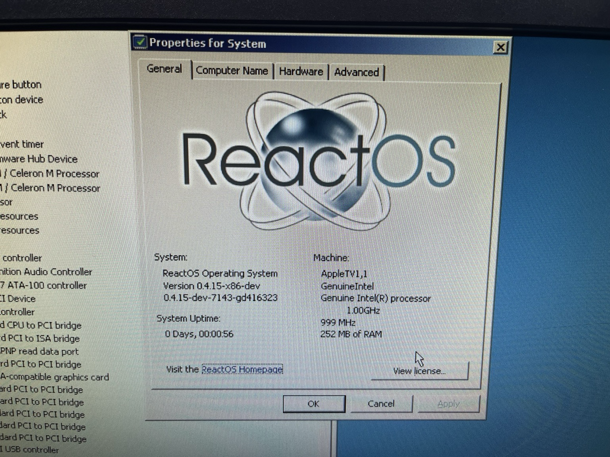

# freeldr-wrapper-appletv
## **THIS PROJECT IS NOT FINISHED OR PRODUCTION READY. DO NOT ATTEMPT TO USE THIS TO INSTALL WINDOWS ON YOUR APPLE TV. IT WILL NOT WORK.**


Wrapper and first stage bootloader for the unofficial original Apple TV port of FreeLoader, allowing ReactOS and
Windows to run on the Apple TV (1st Generation). See below for information on project status and instructions.
## Current project status
Project status as of 12/17/2023: 80% complete. ReactOS will successfully boot to the desktop on both VirtualBox
and real hardware, but PCI does not work correctly, leading to most hardware not working. This issue is an upstream UEFI
issue with ReactOS/FreeLoader.

| Portion                      | Status | Location                                                              | Notes                                                                         |
|------------------------------|--------|-----------------------------------------------------------------------|-------------------------------------------------------------------------------|
| First stage boot loader      | 98%    | This repository                                                       | Ugly hacks must be fixed (see TODO)                                           |
| FreeLoader                   | 98%    | [ReactOS unofficial fork](https://github.com/DistroHopper39B/reactos) | Ugly hacks must be fixed (see TODO)                                           |
| ReactOS booting              | 60%    | [ReactOS unofficial fork](https://github.com/DistroHopper39B/reactos) | USB not working                                                               |
| Windows XP/2003 boot support | 30%    | Microsoft, I guess                                                    | - UEFI video driver not yet working <br/> - ACPI 1.x tables not passed in yet |

## Prebuilt binaries
Available when the ugly hacks are fixed.
## Building
The first (here) and second (ReactOS) stages of this bootloader have entirely different build systems. This
guide will go over both.

*Note: Building on Linux is recommended no matter what, as it will simplify the process later on.*

### Building FreeLoader (Linux, Windows, macOS)
1. [Install the ReactOS build environment](https://reactos.org/wiki/Build_Environment) (Linux users: ignore the PPA, use the link above it for download)
2. Clone/download the unofficial ReactOS: `git clone https://github.com/DistroHopper39B/reactos && cd reactos`
3. Run `./configure.sh -DSARCH=appletv` (Linux, macOS) or `configure.cmd -DSARCH=appletv` (Windows) **from within the ReactOS Build Environment**
4. cd to the output directory (called `output-MinGW-i386` in most cases)
5. Run `ninja freeldr`

FreeLoader will be located at `<output dir>/boot/freeldr/freeldr/freeldr.sys`.

### Building `freeldr-wrapper-appletv` with FreeLoader (macOS)
This is the easiest way to build `freeldr-wrapper-appletv` and will work on macOS 10.8 and above.
1. Install the Xcode Command Line Tools if you haven't already by typing `xcode-select --install` into Terminal
2. Build FreeLoader (see above)
3. Clone/download this repository: `git clone https://github.com/DistroHopper39B/freeldr-wrapper-appletv && cd freeldr-wrapper-appletv`
4. Copy `freeldr.sys` into the `freeldr-wrapper-appletv` directory
5. Run `make`

You will now have a `mach_kernel` file.

### Building `freeldr-wrapper-appletv` with FreeLoader (Linux)
On Linux, we have to cross-compile to generate the correct executable format. These steps should work on any modern Linux distribution.
1. Build FreeLoader (see above)
2. Install prerequisites: `clang llvm libstdc++6 libdispatch autoconf automake` (`libstdc++6` is part of `gcc-libs` on Arch)
3. Clone/download `cctools-port`: `git clone https://github.com/tpoechtrager/cctools-port.git`. This is needed to link for macOS.
4. cd into the correct directory: `cd cctools-port/cctools`
5. Build: `./configure --prefix=/opt/cross --target=i386-apple-darwin8 && make -j$(nproc) && sudo make install`
6. Clone/download this repository: `git clone https://github.com/DistroHopper39B/freeldr-wrapper-appletv && cd freeldr-wrapper-appletv`
7. Run `make`

You will now have a `mach_kernel` file.

### Building `freeldr-wrapper-appletv` with FreeLoader (Windows)
Follow the Linux steps in WSL.

## Usage
The following files must be placed on a specially formatted (we'll get to this later) USB stick:

- `boot.efi`: Apple-official file designed to load a Mac OS X kernel. Instructions for acquiring are below.
- `mach_kernel`: The actual bootloader that we compiled/downloaded earlier. Acts like a Mac OS X kernel to allow `boot.efi` to load it.
- `com.apple.Boot.plist`: A configuration file for the Apple `boot.efi`. Located in `USBData`.
- `/System/Library/Extensions/KernelMemoryAccess.kext`: A "dummy kext" that is only used to make `boot.efi` happy.
- `BootLogo.png`: The graphic seen at the top of this page. If this is not included, a white Apple screen will appear instead.

### Getting `boot.efi`
The Apple TV will only boot using the Apple original `boot.efi` shipped with the device. Since this file cannot
be redistributed, we must download it directly from Apple.

The software update can be found at https://mesu.apple.com/data/OS/061-7495.20100210.TAVfr/2Z694-6013-013.dmg.
It is roughly 235MB in size and has a SHA-1 checksum of `97623d8d21bb59b0f4dc9d1b1c037f25c9fe09c3`. On Windows or Linux,
we can use [7-zip](https://7-zip.org/) or `p7zip` to extract the boot.efi from this file. A one-liner to extract the file
would be:
```shell
7z e 2Z694-6013-013.dmg OSBoot/System/Library/CoreServices/boot.efi
```
On macOS, you can mount the image directly within Finder. `boot.efi` is stored at `/OSBoot/System/Library/CoreServices/boot.efi`.

### Setting up USB boot drive
For now, these instructions will only work on Linux. It is possible to do this process on both Windows and macOS,
but for now, these instructions will only apply to Linux.

First, you will need a USB flash drive. The capacity doesn't matter, but you shouldn't be using it for anything else,
because we will be storing the bootloader on this drive permanently (loading only from the hard drive
is possible but complex).

To set up the USB drive, follow these steps:
1. Install and open [GParted](https://gparted.org).
2. Select your USB drive.
3. Go to `Device -> Create Partition Table`. If necessary, unmount partitions using `Partition -> Unmount`.
4. Set the partition table type to `gpt` and click Apply. **WARNING: THIS WILL DELETE ALL DATA ON YOUR USB FLASH DRIVE!!**
5. Go to `Partition -> New`. Set the filesystem to `fat32` and the label to `boot`.
6. Apply the changes.
7. Select your new partition and go to `Partition -> Flags`, then check the `atvrecv` box.
8. Close GParted. The disk should show up in your file manager's device list. If it doesn't, disconnect and reconnect it.
9. Copy `boot.efi`. `mach_kernel`, `com.apple.Boot.plist`, `BootLogo.png`, and the `System` folder to the root of the USB drive.
10. Eject the USB drive.

### Setting up Windows/ReactOS
More detailed instructions to follow. Basically,
[you have to remove the hard drive from the Apple TV](https://www.ifixit.com/Guide/Apple+TV+1st+Generation+Hard+Drive+Replacement/4799),
install Windows or ReactOS on it through any one of a variety of methods, and reinstall it. As of 11/26/2023, the expected
behavior with [the unoffical ReactOS fork](https://github.com/distrohopper39b/reactos) is a black screen after the
menu appears and a dozen or so DLLs load. 
### TODO
- Fix ugly hacks:
  - The boot struct is placed at physical memory address 0x0. For obvious reasons this is absolutely insane, but it works for now so I haven't bothered fixing it.
## Special Thanks
- [The_DarkFire_](https://github.com/DarkFire01/) for helping me with this process and answering my stupid questions
- The developers of [atv-bootloader](https://github.com/loop333/atv-bootloader) and its predecessors
  - [loop333](https://github.com/loop333/atv-bootloader) for the modern compiler fixes
  - [davilla](https://github.com/davilla/atv-bootloader) (Scott Davilla) for `atv-bootloader` and various workarounds
  - James McKenzie for `mb_boot_tv`, a predecessor to `atv-bootloader`
  - Edgar (gimli) Hucek for the first Linux bootloader, `mach_linux_boot`
- [The OSDev wiki](https://wiki.osdev.org) for helping with my PCI IDE hack
- [The ReactOS developers](https://github.com/reactos/reactos/graphs/contributors) for creating FreeLoader
